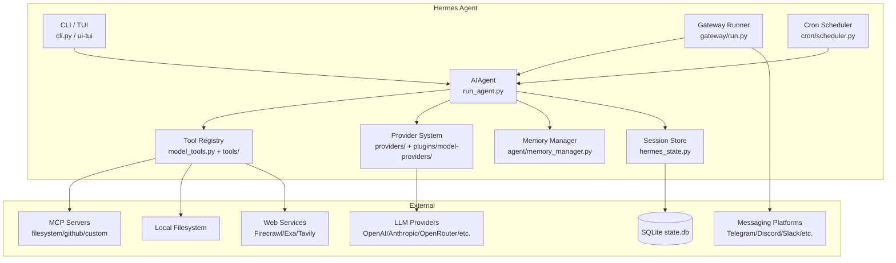
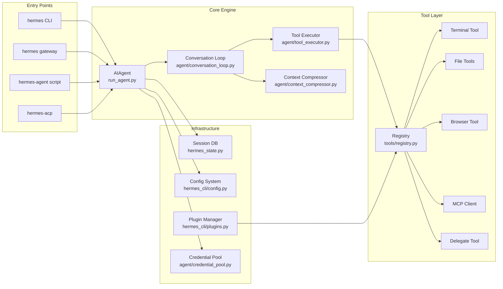
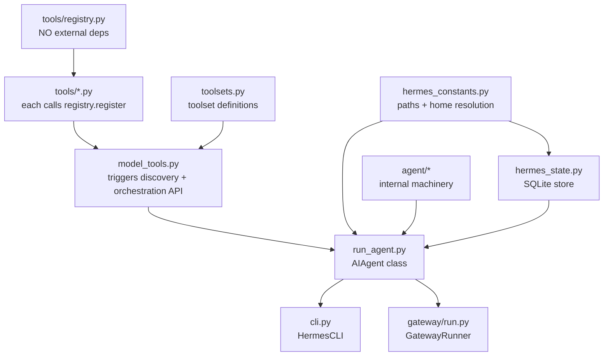
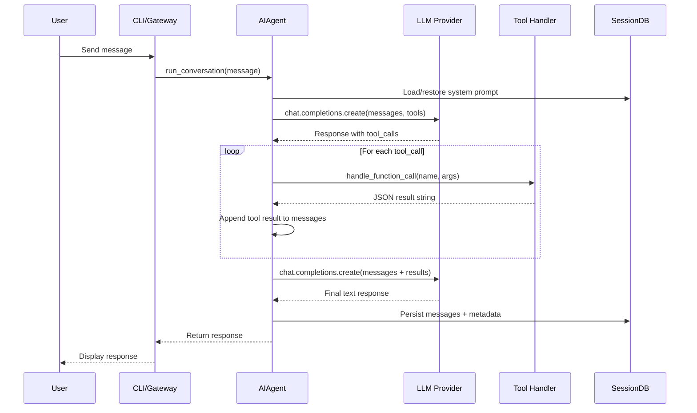
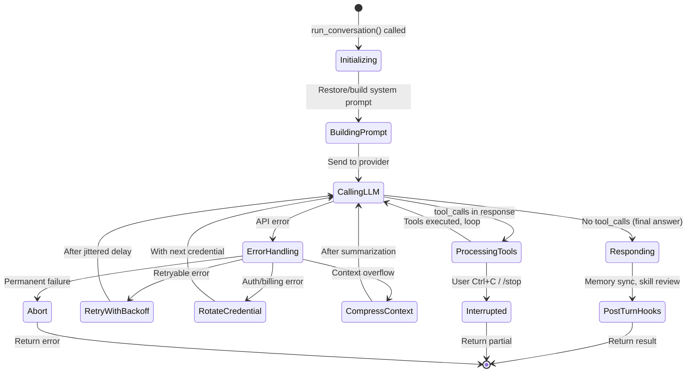
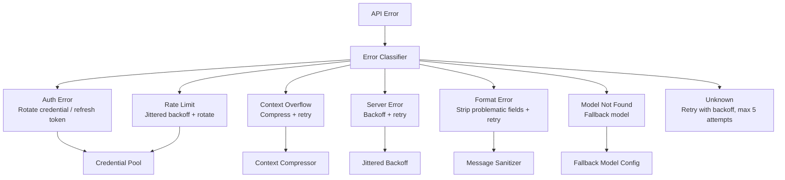
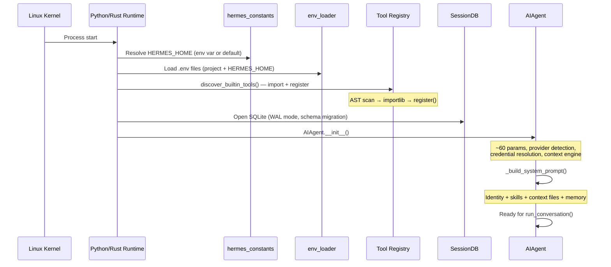
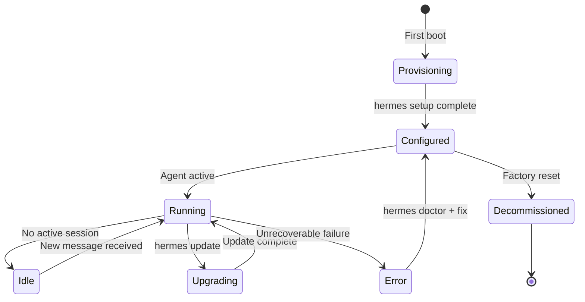

# Hermes Agent — Reverse Engineering Design Document

## How to Use This Document
- **Architects**: Start with sections 1-2 for system overview, then section 7 for design rationale
- **Implementers**: Follow section 9 implementation priority order; reference sections 3-5 per module
- **Reviewers**: Focus on section 8 risks, section 12 security, and section 17 interface contracts
- **Hardware team**: See section 9 platform matrix, section 6 resource budgets, section 10 portability
- **Test engineers**: See section 9 test strategy, section 18 performance baselines
- **Manufacturing/Ops**: See section 16 device lifecycle, section 15 build variants

---

## Section 1: Executive Summary

### System Identity
Hermes Agent is a **self-improving AI agent framework** built by Nous Research. It provides:
- A closed-loop conversational AI agent with tool-calling capabilities
- Autonomous skill creation, improvement, and lifecycle management
- Multi-platform messaging gateway (Telegram, Discord, Slack, WhatsApp, Signal, etc.)
- Persistent memory, session search, and user modeling
- Scheduled automation (cron), delegation (subagents), and multi-agent coordination (kanban)
- Support for 30+ LLM providers via a pluggable provider system

### Problem Solved
Hermes Agent bridges the gap between LLM inference APIs and real-world task execution, providing:
- Tool orchestration (terminal, file I/O, browser, web search, MCP servers)
- Durable conversation state with SQLite-backed sessions
- Self-improving procedural memory (skills) that evolve with use
- Platform-agnostic deployment (laptop, VPS, Docker, serverless)

### Target Deployment (Original)
- **Platform**: Desktop OS (Linux, macOS, Windows/WSL2), Docker, Modal/Daytona serverless, Android/Termux
- **Runtime**: CPython 3.11+ with asyncio, threading, subprocess orchestration
- **Architecture style**: Synchronous agent loop with async I/O bridges, plugin-driven extensibility

### Resource Envelope (Measured)
| Metric | Value |
|--------|-------|
| Codebase size | ~843,000 lines of Python + ~50K lines TypeScript (TUI) |
| Core modules | ~22,500 LOC (run_agent + model_tools + cli + hermes_state) |
| Agent package | ~53,750 LOC (internal machinery) |
| Tools package | ~59,700 LOC (tool implementations) |
| Gateway | ~78,300 LOC (messaging platforms + runner) |
| RAM (idle) | ~80-150 MB (Python interpreter + loaded modules) |
| RAM (active session) | ~200-600 MB (depends on context window, tool state, browser) |
| Storage | ~50-200 MB (SQLite state.db grows with sessions) |
| CPU (idle) | <1% (sleeping between user turns) |
| CPU (active) | Burst to 100% single-core during tool execution; I/O-bound on LLM calls |
| Startup time | ~2-4 seconds (module imports, tool discovery, MCP server connects) |

---

## Section 2: High-Level Architecture

### Architectural Style
**Event-driven synchronous loop with async I/O bridges** — The core agent loop is synchronous (blocking on LLM API calls), with async bridging for:
- MCP server communication (dedicated background event loop)
- Gateway messaging platforms (asyncio-based adapters)
- Parallel tool execution (ThreadPoolExecutor)

This hybrid design was chosen because:
1. The primary operation (LLM API call → tool execution → LLM API call) is inherently sequential
2. Thread-safety is easier to reason about than fully async tool handlers
3. Gateway platforms (Telegram, Discord) require async I/O natively

### System Context Diagram



### Component Block Diagram



### Memory Map (Process Layout)

```
┌─────────────────────────────────────────────────────┐
│ Python Process (~80-600 MB)                         │
├─────────────────────────────────────────────────────┤
│ Interpreter + stdlib                   (~30 MB)     │
├─────────────────────────────────────────────────────┤
│ Imported packages (openai, httpx, etc) (~40 MB)     │
├─────────────────────────────────────────────────────┤
│ Tool registry (schemas, handlers)      (~5 MB)      │
├─────────────────────────────────────────────────────┤
│ Conversation messages (variable)       (~1-50 MB)   │
│  - System prompt (~4-20 KB)                         │
│  - Tool schemas (~50-200 KB)                        │
│  - Message history (grows until compression)        │
├─────────────────────────────────────────────────────┤
│ SQLite state.db (mmap'd WAL)           (~10-200 MB) │
├─────────────────────────────────────────────────────┤
│ MCP event loop thread                  (~2-10 MB)   │
├─────────────────────────────────────────────────────┤
│ ThreadPool workers (delegation)        (~2-8 MB ea) │
├─────────────────────────────────────────────────────┤
│ Browser subprocess (playwright/cdp)    (0 or ~200MB)│
└─────────────────────────────────────────────────────┘
```

#### Section 2b: Module Dependency Graph

**Compile-time (import-order) DAG:**



**Runtime dependency (init order) critical path:**
1. `hermes_constants.py` — resolve HERMES_HOME
2. `hermes_cli/env_loader.py` — load .env files
3. `tools/registry.py` — tool registry singleton
4. `tools/*.py` — auto-register tools (via discover_builtin_tools)
5. `model_tools.py` — orchestration layer ready
6. `hermes_state.py` — SQLite session store
7. `agent/agent_init.py` — AIAgent configured
8. `agent/conversation_loop.py` — ready for user turn

**Circular dependency note:** None identified — the import chain is strictly layered. The `_ra()` lazy-import pattern is used to avoid circular imports while allowing test patches.

---

## Section 3: Detailed Module Breakdown

### 3.1 AIAgent (run_agent.py) — 4,115 LOC
**Purpose:** Core agent class encapsulating a single conversation session.

**Public API:**
```python
class AIAgent:
    def __init__(self, base_url, api_key, provider, model, max_iterations=90, ...)
    def chat(self, message: str) -> str
    def run_conversation(self, user_message, system_message=None, 
                         conversation_history=None, task_id=None) -> dict
```

**Internal data structures:**
- `messages: List[Dict]` — OpenAI-format conversation history
- `_cached_system_prompt: str` — built once, reused for prefix-cache stability
- `iteration_budget: IterationBudget` — thread-safe counter (max 90 parent, 50 subagent)
- `_interrupt_requested: bool` — cooperative interrupt flag
- `_memory_manager: MemoryManager` — orchestrates memory providers
- `_context_compressor: ContextCompressor` — handles context window overflow
- `credential_pool: CredentialPool` — multi-key failover

**Resource budget:**
- RAM: ~5-50 MB per instance (message history dominates)
- CPU: Burst during tool execution, otherwise I/O-waiting
- Threads: 1 primary + up to 8 worker threads for parallel tools

### 3.2 Conversation Loop (agent/conversation_loop.py) — 4,099 LOC
**Purpose:** Drives one user turn through the agent: model call → tool dispatch → retries → compression → post-turn hooks.

**Key algorithm:**
```python
while (api_call_count < max_iterations and budget.remaining > 0) or grace_call:
    if interrupt_requested: break
    response = client.chat.completions.create(model, messages, tools)
    if response.tool_calls:
        for tool_call in response.tool_calls:
            result = handle_function_call(tool_call.name, tool_call.args)
            messages.append(tool_result_message(result))
        api_call_count += 1
    else:
        return response.content
```

**Error handling:** Classified by `error_classifier.py` → retry/rotate/compress/abort decision tree.

### 3.3 Tool Registry (tools/registry.py)
**Purpose:** Zero-dependency singleton that all tool files register into at import time.

**Key pattern:**
```python
registry.register(
    name="terminal",
    toolset="terminal",
    schema={...},
    handler=lambda args, **kw: terminal_tool(...),
    check_fn=check_requirements,
    requires_env=["..."],
)
```

**Discovery:** AST-based static analysis identifies tool files with top-level `registry.register()` calls, then imports them.

### 3.4 Model Tools (model_tools.py) — 913 LOC
**Purpose:** Thin orchestration layer — triggers tool discovery, provides public API (`get_tool_definitions`, `handle_function_call`).

**Async bridging:** `_run_async()` is the single source of truth for sync→async tool execution. Uses:
- Persistent event loop for main thread (prevents "event loop is closed" on cached clients)
- Per-thread persistent loops for worker threads
- Thread-spawning for calls within already-running async contexts

### 3.5 Session Store (hermes_state.py) — 3,193 LOC
**Purpose:** SQLite-backed persistent session storage with FTS5 full-text search.

**Key design:**
- WAL mode for concurrent readers (gateway multi-platform)
- Schema version 11 with migration support
- Fallback to DELETE journal mode on network filesystems
- Thread-safe via per-instance `threading.Lock`

### 3.6 Gateway Runner (gateway/run.py) — ~6,000 LOC
**Purpose:** Long-running daemon managing all messaging platform connections.

**Architecture:**
- One asyncio event loop
- Per-platform adapter (async `connect()` / `disconnect()`)
- Agent cache (LRU, max 128 entries, 1hr idle TTL)
- Session-keyed message queuing during active agent runs

### 3.7 CLI (cli.py) — 14,261 LOC
**Purpose:** Interactive terminal orchestrator with Rich panels, prompt_toolkit input, slash commands, skin engine.

### 3.8 Context Compressor (agent/context_compressor.py)
**Purpose:** Automatic context window compression when messages exceed model limits.

**Algorithm:**
1. Calculate token budget (model context - system prompt - tail protection)
2. Prune old tool outputs (cheap pre-pass)
3. Summarize middle turns via auxiliary LLM (cheap model)
4. Preserve head (system prompt) and tail (recent context)
5. Scale summary budget proportionally to compressed content (20% ratio, 2K-12K tokens)

### 3.9 MCP Client (tools/mcp_tool.py)
**Purpose:** Connects to external MCP servers via stdio/HTTP/SSE, discovers tools, registers them.

**Thread architecture:**
- Dedicated background daemon thread with its own event loop (`_mcp_loop`)
- Each MCP server runs as a long-lived asyncio Task
- Tool calls scheduled via `run_coroutine_threadsafe()`
- Configurable per-server timeouts (connect: 60s, tool call: 120s)

### 3.10 Credential Pool (agent/credential_pool.py)
**Purpose:** Multi-credential failover with rotation strategies.

**Strategies:** fill_first, round_robin, random, least_used
**Exhaustion handling:** Per-credential cooldowns (5min for 401, 1hr for 429/402)

### 3.11 Delegate Tool (tools/delegate_tool.py)
**Purpose:** Spawns isolated child AIAgent instances in ThreadPoolExecutor.

**Isolation model:**
- Fresh conversation (no parent history)
- Own task_id and terminal session
- Restricted toolset (no delegate_task, clarify, memory, send_message, execute_code)
- Configurable max concurrent children (default 3), max spawn depth (default 2)

---

## Section 4: Behavioral Design

### Primary Use Case — Sequence Diagram



### State Machine — Agent Turn Lifecycle



### Concurrency Model

| Thread | Purpose | Priority |
|--------|---------|----------|
| Main thread | Agent loop + CLI input | Normal |
| MCP event loop | Background daemon for MCP servers | Daemon |
| Tool workers (1-8) | Parallel tool execution (delegate_task) | Normal |
| Gateway event loop | Async platform adapters | Normal |
| Cron tick thread | Scheduled job execution | Daemon |
| Browser supervisor | Playwright lifecycle management | Daemon |

**Thread safety mechanisms:**
- `threading.Lock` on: credential pool, session DB, tool registry, iteration budget
- `threading.local()` for: approval callbacks, per-thread event loops
- `contextvars` for: async context propagation across thread boundaries
- Process-global `_last_resolved_tool_names` saved/restored around subagent execution

### Data Flow — Message Transformation

```
User input (str)
    ↓
System prompt assembly (identity + skills + context files + memory)
    ↓
Messages array (OpenAI format: [{role, content, ...}])
    ↓
LLM API call (with tool schemas)
    ↓
Response parsing (text | tool_calls | reasoning)
    ↓
Tool dispatch (sequential or parallel)
    ↓
Result serialization (always JSON string)
    ↓
Messages array grows (tool results appended)
    ↓
Context compression (when budget exceeded)
    ↓
Final response → user
```

### Anti-patterns Identified
1. **Process-global mutable state** (`_last_resolved_tool_names`) — must save/restore around subagents
2. **Module-level constants resolved at import time** — profile system works because `_apply_profile_override()` runs before imports, but this coupling is fragile
3. **Two separate message guard systems in gateway** — both must be coordinated for approval commands
4. **`simple_term_menu` rendering bugs** — legacy code, should not be extended

---

## Section 5: Integration & Interaction Patterns

### Component Discovery & Communication
- **Tool discovery:** AST-based static analysis at import → `importlib.import_module()` → self-registration
- **Plugin discovery:** Filesystem scan of `~/.hermes/plugins/` + pip entry points + repo `plugins/`
- **Provider discovery:** Lazy scan on first `get_provider_profile()` call (bundled → user → legacy)
- **MCP discovery:** Config-driven (`mcp_servers` in config.yaml) → async connection at startup

### Protocol/Serialization
- **LLM communication:** OpenAI Chat Completions API format (JSON over HTTPS)
- **Tool results:** All handlers MUST return a JSON string
- **MCP transport:** JSON-RPC over stdio, HTTP/StreamableHTTP, or SSE
- **TUI transport:** Newline-delimited JSON-RPC over stdio (Ink ↔ Python)
- **Session persistence:** SQLite with JSON-serialized messages
- **Config:** YAML (config.yaml) + dotenv (.env for secrets)

### Error Propagation & Recovery



### Corner Cases Documented
- **Stale tool-tail on gateway restart:** Freshness timestamp prevents auto-continue of old sessions
- **WAL mode on NFS:** Automatic fallback to DELETE journal mode
- **Broken stdio in daemon mode:** `_SafeWriter` wrapper catches OSError
- **Surrogate characters in messages:** Sanitization pipeline strips/replaces
- **MCP server timeout during gateway startup:** Non-blocking discovery since PR #16856
- **Subagent approval deadlock:** Auto-deny callback installed per worker thread

---

## Section 6: Resource Management Deep Dive

### Memory Management Strategy
- **Static allocation:** Module-level constants, tool schemas, provider profiles (~10 MB)
- **Dynamic allocation:** Message history grows unbounded until compression triggers
- **Compression trigger:** When estimated tokens exceed `model_context_length * 0.8`
- **Memory pools:** None (standard Python garbage collection)
- **Zero-copy:** Not applicable (Python string semantics)

### CPU Utilization Model
- **Idle:** <1% — blocked on `prompt_toolkit.prompt()` or asyncio event loop
- **LLM call:** ~0% local CPU (network I/O bound to provider)
- **Tool execution:** 100% single-core burst for terminal commands, file operations
- **Parallel tools:** Up to 8 concurrent threads, CPU-bound varies by tool
- **Token estimation:** O(n) character counting with 4 chars/token heuristic

### Storage & Persistence
- **SQLite state.db:** WAL mode, grows with session count (~1 KB/message)
- **FTS5 index:** Full-text search across all session messages
- **Skills on disk:** `~/.hermes/skills/` — SKILL.md + optional scripts/references
- **Memory files:** `~/.hermes/MEMORY.md`, `~/.hermes/USER.md` — plain text
- **Config:** `~/.hermes/config.yaml` — YAML
- **Logs:** `~/.hermes/logs/` — rotating text files

### Power Management
Not applicable for the original Python implementation. For ARM Cortex-A reimplementation, see Section 9.

---

## Section 7: Design Philosophy & Rationale

### Key Design Decisions

| Decision | Rationale | Trade-off |
|----------|-----------|-----------|
| Synchronous agent loop | Sequential LLM call → tool → LLM is inherently serial; simplifies reasoning about state | Cannot overlap tool execution with streaming |
| OpenAI-format messages as canonical | Maximum provider compatibility; adapter pattern for Anthropic/Gemini | Lossy conversion for provider-specific features |
| Plugin system (not monolith) | Extensibility without core code changes; supply-chain isolation | Discovery overhead; version coupling |
| Exact PyPI pinning | Supply-chain attack mitigation (Mini Shai-Hulud incident) | Manual dependency updates required |
| SQLite for sessions | Zero-config, embedded, concurrent reads via WAL | Single-writer limitation |
| Skills as Markdown files | Human-readable, version-controllable, LLM-friendly | No compiled validation, parsing overhead |
| Lazy imports (OpenAI SDK, Anthropic SDK) | 240ms+ import saved on cold start | Deferred ImportError discovery |
| Thread-local approval callbacks | Prevents stdin deadlock in subagent threads | Global state save/restore needed |
| Persistent event loop for async bridging | Prevents "event loop is closed" on cached httpx clients | Process-global loop management |
| Tool results always JSON strings | Uniform interface, sanitizable, size-measurable | Serialization overhead for binary data |
| Context compressor with auxiliary LLM | Preserves semantic content vs. truncation | Latency + cost of summarization call |
| Profile-aware HERMES_HOME | Multi-instance isolation | Must use `get_hermes_home()` everywhere |

### Why Python (Original Choice)
- Rapid prototyping for AI/ML ecosystem
- Rich library ecosystem (openai, anthropic, httpx, playwright)
- Cross-platform without compilation
- Developer familiarity for contributors

---

## Section 8: Risk Assessment & Gap Analysis

### Technical Debt Indicators
1. **cli.py at 14,261 LOC** — God object; should be further decomposed
2. **run_agent.py still 4,115 LOC** after multiple extractions — agent state scattered across instance attributes
3. **Process-global `_tool_loop`** — contention risk if multiple agents in same process
4. **Module-level import of `model_tools.py`** triggers all tool discovery — no lazy loading per toolset
5. **Two message guard systems in gateway** — fragile coordination

### Fragile Areas
- **Prompt caching contract:** Any mid-conversation system prompt mutation breaks cache, causing cost explosion
- **Subagent `_last_resolved_tool_names` global** — save/restore can race
- **Config version migration** — schema bump only needed for structural changes, but the heuristic is easy to misjudge
- **MCP server Task lifecycle** — anyio cancel-scope must close in the same Task that opened it

### Missing Error Handling
- Some tool handlers may not catch all exceptions before returning to the agent loop
- File permission errors on `~/.hermes/` are discovered late (at write time)
- Browser subprocess crashes may leave orphan processes

### Silent Assumptions
- Python 3.11+ is available (no fallback for 3.10)
- UTF-8 filesystem encoding (works on Linux/macOS, needs bootstrap on Windows)
- Network connectivity for LLM API calls (no offline mode for inference)
- `~/.hermes/` is on a local filesystem (WAL issues on NFS documented but not always surfaced early)
- Tool execution has access to the same filesystem as the agent process
- LLM providers follow OpenAI API response format (or close enough for adapters)
- SQLite is compiled with FTS5 support (standard on CPython bundled sqlite3)

### Embedded/Edge-Specific Risks for Reimplementation
- **Memory growth:** Conversation messages grow unbounded until compression — must be bounded for edge
- **Thread count:** Up to 8 tool workers + MCP thread + gateway loop — many for embedded
- **Python GC pauses:** Unpredictable for real-time constraints
- **Large dependency tree:** openai, httpx, pydantic, rich — significant footprint
- **SQLite WAL on constrained storage:** Write amplification concern
- **Network-dependent:** Every LLM call requires external network access

---

## Section 9: Reimplementation Guidance for Edge Deployment

### Platform Suitability Matrix

| Criterion | Requirements from Design |
|-----------|------------------------|
| Minimum RAM | 64 MB (core agent loop + one session) — 256 MB recommended |
| Minimum Flash/ROM | 32 MB (binary + skills + config) — 128 MB recommended |
| Real-time guarantees needed | Best-effort (no hard RT; tool execution is variable latency) |
| Peripheral interfaces required | Network (Ethernet/WiFi), storage (eMMC/SD), optional UART for debug |
| OS services required | Threads, async I/O, filesystem, TCP/IP stack, TLS, DNS, SQLite |
| Network stack requirements | HTTPS client, WebSocket client, SSE client |
| Security requirements | TLS 1.2+, API key storage, optional credential encryption |
| Power budget | Not critical — always-on or suspend-to-RAM acceptable |

### Platform Recommendations (ARM Cortex-A, Multi-Core)

| Platform | Fit | Notes |
|----------|-----|-------|
| **Embedded Linux (Yocto/Buildroot)** | ★★★★★ | Best fit. Full POSIX, TLS, SQLite, threading all available. Multi-core SMP supported. Smallest viable rootfs ~50 MB. |
| **Android AOSP (stripped)** | ★★★★☆ | Already proven (Termux path). Full networking stack. Overhead from framework services. |
| **Zephyr RTOS** | ★★☆☆☆ | Possible but painful — no POSIX filesystem, limited networking, no Python. Would require ground-up rewrite. |
| **FreeRTOS + lwIP** | ★☆☆☆☆ | Too constrained — no filesystem, no threads in the required sense, single-threaded event loop only. |

**Recommended target: Embedded Linux (Yocto) on Cortex-A53/A55/A72/A76 quad-core.**

### Language Recommendation

| Language | Strengths | Weaknesses | Effort Estimate |
|----------|-----------|------------|-----------------|
| **Rust** | Memory safety, fearless concurrency, async/await, strong HTTP ecosystem (reqwest, tokio), SQLite (rusqlite), JSON (serde). Zero-cost abstractions. | Steeper learning curve, slower iteration. Async ecosystem fragmented (tokio vs async-std). | 6-9 months (2-3 senior engineers) |
| **C++17/20** | Mature embedded ecosystem, familiar to embedded teams, full coroutine support (C++20), Boost.Beast for HTTP. | Manual memory management, footgun density, no built-in async runtime. | 8-12 months (3-4 engineers) |
| **Go** | Goroutines map naturally to agent concurrency model, excellent HTTP/JSON stdlib, fast compilation, simple deployment. | Larger binary size (~10-20 MB), GC pauses (though tunable), less common in embedded. | 4-6 months (2-3 engineers) |
| **C** | Smallest footprint, maximum hardware control. | No async/await, manual everything, enormous engineering effort for HTTP/JSON/TLS/SQLite orchestration. | 12-18 months (4+ engineers) |

**Recommended: Rust** — Best balance of safety, performance, and ecosystem maturity for a system that must handle concurrent HTTP, JSON parsing, SQLite, and complex state machines without GC pauses.

### Performance-Critical Path Optimization Guide

**Hot paths (must be fast):**
1. **Token estimation** — Called on every message; currently O(n) string scan. Keep as O(n) but avoid allocations.
2. **Tool schema serialization** — Built once per session; can be cached as bytes.
3. **Message sanitization** — Regex-based; compile patterns once, reuse.
4. **JSON parsing of tool results** — Hot in parallel tool execution; use zero-copy parser.
5. **SQLite FTS5 indexing** — Runs on every message persist; batch if possible.

**Algorithms that must remain efficient:**
- Jittered backoff: O(1) — trivial
- Tool availability check: O(n) where n = number of tools (~40-80) — fine
- Context compression decision: O(n) token estimation over all messages — unavoidable
- Credential rotation: O(1) from pool — maintain

### Memory Budget Allocation Guide (256 MB target)

| Module | Budget | Notes |
|--------|--------|-------|
| OS + runtime | 32 MB | Kernel, libc, TLS libs, SQLite |
| Agent core | 16 MB | State machines, config, schemas |
| HTTP client pool | 32 MB | TLS sessions, connection buffers |
| Message history | 64 MB | Bounded ring buffer with compression trigger |
| Tool execution scratch | 32 MB | Subprocess I/O buffers |
| SQLite + WAL | 48 MB | DB file + shared memory pages |
| MCP client | 16 MB | Per-server connection state |
| Headroom | 16 MB | Spikes, fragmentation |

### Implementation Priority Order

1. **Configuration system** — YAML parsing, env loading, profile resolution
2. **HTTP client with TLS** — Provider communication foundation
3. **OpenAI-format message types** — Core data structures
4. **LLM API caller** — Single-provider chat completions
5. **Tool registry + dispatch** — Schema, handler registration, invocation
6. **Terminal tool** — Subprocess execution (most important single tool)
7. **Conversation loop** — The core while-loop with tool dispatch
8. **Error classifier + retry** — Resilient API communication
9. **Context compressor** — Prevent context overflow
10. **Session persistence (SQLite)** — Durable state
11. **File tools** — read/write/patch/search
12. **Credential pool** — Multi-key failover
13. **MCP client** — External tool server integration
14. **Gateway (single platform)** — Start with one messaging platform
15. **Delegation** — Subagent spawning
16. **Skills system** — Procedural memory
17. **Memory system** — Persistent user modeling
18. **Cron scheduler** — Automation

Modules 1-6 can be stubbed during early development.
Modules 7-10 form the minimum viable agent.
Modules 11-18 are progressive enhancement.

### Test Strategy for Edge Targets

- **Unit tests (host):** Mock HTTP responses, verify state machine transitions, test JSON serialization — run on x86 dev machines with standard test frameworks
- **Integration tests (target):** Real LLM API calls from target hardware, verify TLS negotiation, measure latency
- **Performance regression:** Track: conversation loop iteration time, token estimation throughput, SQLite write latency
- **Memory tests:** Bounded buffer verification — ensure no OOM under sustained conversation
- **Network resilience:** Simulate packet loss, DNS failure, TLS handshake timeout
- **Endurance:** 72-hour continuous operation test (conversation every 5 minutes, context compression cycles)
- **Power:** Measure current draw in active vs. idle states
- **Code coverage target:** 80% line coverage on core modules (agent loop, error classifier, compressor)

---

## Section 10: Portability Analysis

### Platform-Specific Code Inventory

| Category | Percentage | Files |
|----------|-----------|-------|
| Platform-agnostic Python | ~95% | Most of codebase |
| POSIX-specific (fcntl, signal) | ~2% | cron/scheduler.py, terminal_tool.py |
| Windows-specific (msvcrt, pywinpty) | ~1% | hermes_bootstrap.py, terminal_tool.py |
| macOS-specific (osascript, computer_use) | ~1% | tools/computer_use/ |
| Linux-specific (/proc, systemctl) | ~1% | some optional skills |

### Assumptions About Environment
- **Endianness:** Not relevant (Python abstracts this); for Rust/C++ reimplementation: ARM is configurable, assume little-endian
- **Word size:** 64-bit assumed (Python int is arbitrary precision); Cortex-A is 64-bit (AArch64)
- **Alignment:** Not relevant in Python; for C/C++: respect natural alignment on AArch64
- **Floating-point:** Used for token estimation, timing; ARM VFP/NEON available on Cortex-A
- **Integer overflow:** Python: no overflow; Rust: checked in debug, wrapping in release

### Compiler/Toolchain Dependencies
- **Python 3.11+** — async features, exception groups, `tomllib`
- **Node.js** — TUI (Ink/React terminal UI)
- **C extensions:** Some pip packages have C components (pydantic-core, uvloop, lxml)

### Key Portability Challenges for ARM Cortex-A
1. **Python interpreter itself** — Must cross-compile CPython or use Rust/C++ rewrite
2. **openai SDK** — HTTP client with complex retry logic; reimplement with reqwest/libcurl
3. **SQLite** — Available natively, excellent ARM support
4. **TLS (OpenSSL/rustls)** — Standard on embedded Linux
5. **playwright/browser** — Not available on embedded; replace with lightweight HTTP client
6. **prompt_toolkit/Rich** — TUI libraries; replace with serial console or omit

---

## Section 11: Boot & Initialization Sequence



**Failure handling:**
- `.env` missing → use system env vars (logged INFO)
- SQLite open fails → session features disabled (WARNING)
- Tool import fails → that tool unavailable, others work (WARNING)
- Provider unreachable → classified as timeout, retried

---

## Section 12: Security Architecture

### Trust Boundaries

```
┌───────────────────────────────────────────────┐
│ TRUSTED: Agent Process                         │
│  ├─ Config files (~/.hermes/config.yaml)       │
│  ├─ API keys (~/.hermes/.env)                  │
│  ├─ Session database (state.db)                │
│  └─ Skills (SKILL.md files)                    │
├───────────────────────────────────────────────┤
│ SEMI-TRUSTED: LLM Provider Responses           │
│  ├─ Tool call requests (validated by schema)   │
│  └─ Text responses (sanitized for display)     │
├───────────────────────────────────────────────┤
│ UNTRUSTED: External Input                      │
│  ├─ User messages (messaging platforms)        │
│  ├─ Web content (web_extract results)          │
│  ├─ Context files (AGENTS.md — injection scan) │
│  └─ MCP server responses                      │
└───────────────────────────────────────────────┘
```

### Security Mechanisms
1. **Context file injection scanning** — Pattern-based detection of prompt injection in AGENTS.md, .cursorrules
2. **Command approval system** — Dangerous terminal commands require explicit user approval
3. **Tool guardrails** — `ToolCallGuardrailController` enforces per-tool policies
4. **Credential isolation** — API keys in .env only, never in config.yaml
5. **Path security** — `tools/path_security.py` prevents traversal attacks
6. **Streaming content scrubbing** — `StreamingContextScrubber` strips injected `<memory-context>` tags
7. **Gateway DM pairing** — Messaging platforms verify authorized users
8. **File safety** — `agent/file_safety.py` validates write targets
9. **Website policy** — `tools/website_policy.py` restricts browser navigation
10. **Skill provenance** — Tracks agent-created vs. user-installed skills (curator respects boundary)

### Cryptographic Operations
- **TLS 1.2+** — All LLM API communication (via httpx/openai SDK)
- **JWT (PyJWT)** — GitHub App auth for Skills Hub
- **OAuth tokens** — Anthropic, Google, Copilot credential flows
- **No local encryption at rest** — API keys stored as plaintext in .env (relies on filesystem permissions)

### Attack Surface
- **Network:** HTTPS endpoints to LLM providers, MCP servers, web scraping targets
- **Local:** Terminal command execution (gated by approval), file system access
- **Messaging:** Webhook endpoints for Telegram/Discord/Slack (authenticated per platform)
- **Supply chain:** PyPI dependencies (mitigated by exact pinning)

---

## Section 13: Communication & Network Architecture

### Protocol Stack

```
┌─────────────────────────┐
│ Application Layer        │
│  - OpenAI Chat API      │
│  - Anthropic Messages   │
│  - MCP (JSON-RPC)       │
│  - Telegram Bot API     │
│  - Discord Gateway WS   │
├─────────────────────────┤
│ Session Layer            │
│  - HTTP/2, WebSocket    │
│  - SSE (Server-Sent)    │
├─────────────────────────┤
│ Transport Layer          │
│  - TLS 1.2/1.3          │
│  - TCP                  │
├─────────────────────────┤
│ Network Layer            │
│  - IPv4/IPv6            │
│  - DNS resolution       │
└─────────────────────────┘
```

### Connection Lifecycle
1. **LLM providers:** Persistent HTTP/2 connections via httpx client pool. Reconnect on timeout/error.
2. **MCP servers (stdio):** Long-lived subprocess with stdin/stdout JSON-RPC. Reconnect with exponential backoff (up to 5 retries).
3. **MCP servers (HTTP):** Per-call HTTP requests or persistent SSE stream.
4. **Messaging (Telegram):** Long-polling or webhook. Token lock prevents duplicate profile connections.
5. **Messaging (Discord):** WebSocket gateway with heartbeat. Auto-reconnect.

### Offline Behavior
- **No offline inference** — System requires network for LLM API calls
- **Skills loaded from disk** — Available offline (no network needed for skill content)
- **Session DB on local disk** — Available offline
- **Tool execution (terminal/file)** — Fully offline-capable

### Bandwidth Considerations
- **LLM API calls:** ~1-100 KB request, ~1-50 KB response (text). Images: 1-5 MB.
- **Streaming:** Token-by-token SSE events, ~50 bytes each
- **MCP:** Small JSON-RPC messages, typically <10 KB

---

## Section 14: Observability & Debug Design

### Logging Strategy
- **Levels:** DEBUG, INFO, WARNING, ERROR (configurable per session)
- **Output:** `~/.hermes/logs/agent.log` (INFO+), `errors.log` (WARNING+), `gateway.log`
- **Session tagging:** `set_session_context(session_id)` — enables `hermes logs --session <id>`
- **Structured logging:** Python `logging` module with format strings (not structured JSON)
- **Display:** KawaiiSpinner for user-facing progress; `┊` activity feed for tool results

### Debug Interfaces
- **`hermes doctor`** — Diagnostic tool checking configuration, connectivity, dependencies
- **`hermes logs`** — Log viewer with filtering (--follow, --level, --session)
- **`/usage`** — Token usage and cost estimation for current session
- **`/insights`** — Usage analytics over time
- **Web tools debug mode:** `WEB_TOOLS_DEBUG=true` creates detailed JSON debug files

### Runtime Diagnostics
- **Iteration budget tracking** — `budget.used` / `budget.remaining` visible in logs
- **Error classification** — Every API error logged with `FailoverReason` and recovery action
- **Context compression events** — Logged with token counts before/after
- **Credential pool status** — Logged when credentials rotate or exhaust
- **MCP server health** — Connection/disconnection events logged

---

## Section 15: Build Configuration & Hardware Variants

### Build System
- **Python packaging:** `pyproject.toml` (setuptools backend)
- **Dependency management:** `uv` (fast pip alternative) with `uv.lock` for reproducibility
- **Optional extras:** 20+ extras for provider-specific dependencies (anthropic, bedrock, voice, etc.)
- **TUI:** npm/Node.js build (TypeScript → JavaScript bundle)

### Variant Matrix

| Variant | Included Extras | Use Case |
|---------|----------------|----------|
| Core (minimal) | Base dependencies only | Headless API agent |
| CLI | +cli, +pty | Interactive terminal |
| Full | +all (13 extras) | Developer workstation |
| Termux | +termux (Android subset) | Mobile |
| Gateway | +messaging | Multi-platform bot |
| Edge (proposed) | Core only, no pip | ARM embedded target |

### Feature Gating
- **Runtime:** Tool availability via `check_fn()` — returns bool based on env vars, installed packages
- **Config-driven:** `tools.<platform>.enabled/disabled` lists in config.yaml
- **Lazy deps:** `tools/lazy_deps.py` — install-on-first-use for provider SDKs

### Scaling Behavior
- **More RAM:** Larger context windows, more concurrent sessions in gateway
- **Faster CPU:** Faster token estimation, tool execution, JSON parsing
- **More cores:** More parallel tool workers, more concurrent MCP servers
- **Less RAM (edge):** Smaller context window, fewer concurrent operations, aggressive compression

---

## Section 16: Device Lifecycle Management

### Lifecycle States (for Edge Deployment)



### Provisioning (First Boot)
1. Install runtime (Python/Rust binary)
2. Create `~/.hermes/` directory structure
3. Run `hermes setup` — configure provider, API keys, model
4. Optional: `hermes gateway setup` for messaging platforms
5. Verify: `hermes doctor`

### Configuration Data
- `config.yaml` — All behavioral settings
- `.env` — API keys only (secrets)
- `auth.json` — OAuth tokens (refreshable)
- `state.db` — Session history
- `skills/` — Procedural memory
- `MEMORY.md`, `USER.md` — Persistent memory

### Update Mechanism
- `hermes update` — Git pull + `uv pip install -e .`
- Config migration via `_config_version` bumps
- Session DB schema migration (version 11, forward-compatible)
- No rollback mechanism (git-based; can `git checkout` manually)

### Factory Reset
- Delete `~/.hermes/` directory
- Re-run `hermes setup`

---

## Section 17: Interface Contracts & Invariants

### AIAgent.run_conversation()
- **Precondition:** Valid `base_url` + `api_key` OR configured provider
- **Postcondition:** Returns `{"final_response": str, "messages": list}` or raises
- **Invariant:** `len(messages)` grows monotonically within a turn (compression only between turns)
- **Thread-safety:** NOT thread-safe — one turn at a time per instance
- **Timing:** Unbounded (depends on LLM latency + tool execution); budget-limited by `max_iterations`
- **Error contract:** Returns error dict on non-retryable failure; never raises to caller after init

### Tool Handler (registry.register handler)
- **Precondition:** `args` is a dict matching the schema's parameters
- **Postcondition:** Returns a JSON string (always)
- **Invariant:** Handler must not modify global agent state directly
- **Thread-safety:** Must be safe for concurrent execution (parallel tools)
- **Timing:** Bounded by `tool_timeout` (default 120s for MCP, 300s for terminal)
- **Error contract:** On failure, return `json.dumps({"error": "..."})`

### IterationBudget
- **Precondition:** `max_total >= 1`
- **Postcondition:** `remaining >= 0` always
- **Invariant:** `used + remaining == max_total`
- **Thread-safety:** Fully thread-safe via internal Lock
- **Timing:** O(1) for all operations

### SessionDB
- **Precondition:** SQLite available with FTS5 support
- **Postcondition:** Data persisted to disk after successful write
- **Invariant:** Schema version matches SCHEMA_VERSION (migration applied at open)
- **Thread-safety:** Per-instance Lock; safe for multi-reader single-writer
- **Error contract:** Methods return None/empty on failure, never raise to caller

### CredentialPool
- **Precondition:** At least one credential registered
- **Postcondition:** `next_credential()` returns valid credential or raises exhausted
- **Invariant:** Exhausted credentials have cooldown timer; auto-recover after TTL
- **Thread-safety:** Fully thread-safe via internal Lock
- **Ownership:** Pool owns credential lifecycle; callers get copies

---

## Section 18: Performance Baselines & Acceptance Criteria

### Latency Budgets

| Operation | P50 | P99 | Limit | Measurement Point |
|-----------|-----|-----|-------|-------------------|
| Startup to ready | 2s | 4s | 10s | First prompt shown |
| Token estimation (1K msg) | 1ms | 5ms | 50ms | `estimate_tokens_rough()` return |
| Tool schema serialization | 5ms | 20ms | 100ms | `get_tool_definitions()` return |
| SQLite session write | 2ms | 10ms | 100ms | `persist_messages()` return |
| Terminal command (ls) | 50ms | 200ms | 5000ms | Tool result returned |
| Context compression | 2s | 10s | 30s | Aux LLM summarization complete |
| Credential rotation | 1ms | 5ms | 100ms | New credential selected |
| MCP tool call | 200ms | 2s | 120s | Per-server timeout |

### Throughput Targets

| Metric | Target | Notes |
|--------|--------|-------|
| Messages/sec (session persist) | 50+ | SQLite WAL write throughput |
| Concurrent gateway sessions | 128 | Agent cache cap |
| Parallel tool executions | 8 | ThreadPoolExecutor workers |
| MCP servers simultaneously | 20+ | Each on dedicated async task |
| Cron jobs per minute | 10 | Hard 3-minute session interrupt |

### Boot Time Budget

| Phase | Budget | Notes |
|-------|--------|-------|
| Python interpreter start | 200ms | Or Rust binary load |
| Module imports (core) | 500ms | Lazy imports defer SDK loading |
| Tool discovery (AST scan) | 300ms | ~90 tool files scanned |
| Config/env loading | 50ms | YAML parse + .env |
| SessionDB open | 100ms | SQLite + schema check |
| First prompt ready | 2000ms | Total cold start |

### Memory Watermarks

**Original Python implementation:**

| State | Expected | Hard Limit (Edge) |
|-------|----------|-------------------|
| Just started | 80 MB | 128 MB |
| Active session (short) | 150 MB | 256 MB |
| Active session (long, pre-compress) | 400 MB | 512 MB |
| After compression | 200 MB | 256 MB |
| Gateway (10 sessions cached) | 500 MB | 1 GB |

**Strategy 2 (Rust + subprocess Python) — see Add-On section for full analysis:**

| State | Expected | Hard Limit (Edge) |
|-------|----------|-------------------|
| Just started | 12-20 MB | 32 MB |
| Active session (short) | 30-60 MB | 128 MB |
| Active session (long, pre-compress) | 80-140 MB | 256 MB |
| During Python script execution | +30-60 MB transient | 256 MB |
| After compression | 40-80 MB | 128 MB |
| Gateway (10 sessions cached) | 80-250 MB | 512 MB |

---

## Add-On: Multi-Core ARM Cortex-A Specific Guidance

### Target Hardware Profile
- **Processor:** ARM Cortex-A53/A55 (efficiency) or A72/A76 (performance), quad-core
- **Architecture:** ARMv8-A (AArch64), 64-bit
- **Expected SoC examples:** Raspberry Pi 4/5 (BCM2711/2712), Rockchip RK3588, NXP i.MX 8M, Qualcomm QCS6490
- **RAM:** 512 MB – 4 GB LPDDR4/4x
- **Storage:** 8-64 GB eMMC / SD card
- **Network:** Ethernet 1Gbps + WiFi 5/6
- **OS:** Linux 5.15+ (Yocto/Buildroot or Debian-based)

### Multi-Core Utilization Strategy

```
Core 0: Agent main loop (conversation state machine)
Core 1: HTTP client I/O (TLS, provider communication)
Core 2: Tool execution (subprocess management, file I/O)
Core 3: Background services (MCP, cron, gateway I/O)
```

**Rust async runtime mapping:**
- Use `tokio` multi-threaded runtime with work-stealing scheduler
- Pin latency-sensitive tasks (agent loop) to specific cores via `core_affinity`
- Use `tokio::task::spawn_blocking()` for synchronous tool execution
- Channel-based communication between subsystems (no shared mutable state)

### Core Assignment Recommendations

| Subsystem | Threading Model | Core Affinity |
|-----------|----------------|---------------|
| Agent state machine | Single-threaded async (select! loop) | Core 0 (pinned) |
| HTTP connection pool | Async I/O (tokio reactor) | Core 1 (preferred) |
| Terminal tool execution | spawn_blocking + subprocess | Core 2 (preferred) |
| MCP client tasks | Async tasks on shared runtime | Cores 1-3 (work-stealing) |
| SQLite writes | Single-writer thread with channel | Core 0 (same as agent) |
| Gateway adapters | Async tasks per platform | Cores 1-3 (work-stealing) |
| Cron scheduler | Timer-driven async task | Any core |

### IPC Mechanisms

| Communication | Mechanism | Rationale |
|---------------|-----------|-----------|
| Agent → Tool executor | `tokio::sync::mpsc` channel | Ordered, backpressure |
| Tool executor → Agent | `tokio::sync::oneshot` per call | Single response per call |
| Agent → SQLite writer | `tokio::sync::mpsc` (unbounded) | Fire-and-forget persist |
| MCP server → Registry | `tokio::sync::watch` for schema updates | Multiple readers |
| Gateway → Agent | `tokio::sync::mpsc` per session | Session isolation |
| Interrupt signal | `tokio::sync::Notify` | Cooperative cancellation |

### Memory Layout for Cortex-A (256 MB Target)

```
┌─────────────────────────────────────────┐  0x0000_0000
│ Linux Kernel + modules      (32 MB)     │
├─────────────────────────────────────────┤  0x0200_0000
│ Agent binary + .rodata      (8 MB)      │
├─────────────────────────────────────────┤  0x0280_0000
│ Heap: HTTP buffers + TLS    (32 MB)     │
├─────────────────────────────────────────┤  0x0480_0000
│ Heap: Message ring buffer   (64 MB)     │
├─────────────────────────────────────────┤  0x0880_0000
│ Heap: SQLite shared cache   (32 MB)     │
├─────────────────────────────────────────┤  0x0A80_0000
│ Heap: Tool scratch space    (32 MB)     │
├─────────────────────────────────────────┤  0x0C80_0000
│ Stack: per-thread (4×1MB)   (4 MB)      │
├─────────────────────────────────────────┤  0x0CC0_0000
│ Headroom + mmap'd files     (52 MB)     │
└─────────────────────────────────────────┘  0x1000_0000

Total: 256 MB
```

### Power Optimization (Cortex-A)

| State | Strategy | Expected Current (typical SoC) |
|-------|----------|-------------------------------|
| Active (LLM call in flight) | All cores active, network active | 500-1500 mA |
| Waiting for user | Cores 1-3 in WFI, Core 0 polling epoll | 100-300 mA |
| Deep idle (no sessions) | CPU frequency scaling to minimum, WiFi power-save | 50-150 mA |
| Suspended | Suspend-to-RAM, wake on network interrupt | 5-20 mA |

**Implementation:**
- Use Linux cpufreq governor (`schedutil` or `ondemand`)
- Put idle cores in WFI (Wait For Interrupt) — handled by kernel
- WiFi power management via `iw` or driver-specific controls
- Suspend-to-RAM for long idle periods (>30 minutes without activity)

### Build System (Rust + Cross-Compilation)

```toml
# Cargo.toml (workspace)
[workspace]
members = [
    "hermes-core",      # Agent loop, state machine, message types
    "hermes-tools",     # Tool implementations
    "hermes-network",   # HTTP client, MCP, TLS
    "hermes-storage",   # SQLite, config, skills
    "hermes-gateway",   # Messaging platform adapters
    "hermes-cli",       # Terminal UI (optional on embedded)
]

[profile.release]
opt-level = "s"         # Optimize for size on embedded
lto = true              # Link-time optimization
strip = true            # Strip debug symbols
panic = "abort"         # No unwinding (saves ~100KB)
```

**Cross-compilation:**
```bash
# Install target
rustup target add aarch64-unknown-linux-gnu

# Cross-compile
cargo build --release --target aarch64-unknown-linux-gnu

# Expected binary size: 5-15 MB (with all features)
```

### Minimum Viable Edge Agent

For first deployment on Cortex-A, implement only:
1. Config loading (YAML/env)
2. Single LLM provider (OpenAI-compatible)
3. Terminal tool (subprocess execution)
4. File tools (read/write/search)
5. Conversation loop with compression
6. SQLite session persistence
7. Serial console interface (no TUI)

**Expected binary:** ~5 MB
**Expected RAM:** ~32 MB idle, ~128 MB active
**Expected startup:** <500 ms

This gets a working agent on hardware with subsequent features added incrementally.

---

## Add-On: Python Compatibility & Skill Impact Analysis

### Skills System Architecture (Key Insight)

Skills in Hermes are **primarily Markdown documents** — they are procedural instructions
injected into the LLM's context as a user message. The agent reads the SKILL.md file
and follows the instructions using its available tools. Skills are NOT compiled code
modules — they are prompt engineering artifacts.

This means most skills are **language-agnostic**: whether the agent core is Python,
Rust, or anything else, as long as the agent can read a Markdown file and call tools,
the skill works identically.

### Skill Dependency Classification (87 Built-in Skills)

| Category | Count | % | Impact of Rust Rewrite |
|----------|-------|---|------------------------|
| **Pure Markdown** (no scripts) | 71 | 82% | ✅ Zero impact — works unchanged |
| **Ships Python scripts** | 12 | 14% | ❌ Needs Python runtime on target |
| **Ships shell scripts only** | 4 | 4% | ✅ Works (shell available on Linux) |

### Skills with Hard Python Script Dependencies

These skills ship `.py` files that the agent invokes via the `terminal` tool
(e.g., `python3 google_api.py gmail search "..."`):

| Skill | Python Files | Purpose |
|-------|-------------|---------|
| `creative/comfyui` | 16 | ComfyUI workflow runner |
| `creative/pixel-art` | 4 | Pixel art generation with PIL |
| `creative/excalidraw` | 1 | Diagram export |
| `productivity/google-workspace` | 4 | OAuth setup + Gmail/Calendar/Drive bridge |
| `productivity/powerpoint` | 7 | PPTX generation |
| `productivity/ocr-and-documents` | 2 | PDF extraction (PyMuPDF/marker) |
| `productivity/linear` | 1 | Linear API client |
| `productivity/maps` | 1 | Maps API client |
| `media/youtube-content` | 1 | YouTube transcript fetcher |
| `research/arxiv` | 1 | arXiv paper search |
| `research/polymarket` | 1 | Prediction market data |
| `red-teaming/godmode` | 4 | Jailbreak testing scripts |

### The `execute_code` Tool (Critical Capability)

Beyond skills, the `execute_code` tool (Programmatic Tool Calling / PTC) is a **core
agent capability** that runs in ~5-20% of conversations. It lets the LLM write Python
scripts that call Hermes tools via RPC, collapsing multi-step tool chains into a single
inference turn. Without Python, this capability is lost entirely.

### Optional Skills (81 additional skills)

The `optional-skills/` directory contains 81 more skills with 48 Python files.
These follow the same pattern — heavier skills that users install explicitly.

### Recommended Strategy: Hybrid (Rust Core + Subprocess Python)

Ship a **stripped CPython 3.11** cross-compiled for AArch64 alongside the Rust binary.
Python is invoked only via subprocess for:
- Skill helper scripts (12 skills, ~14% of built-in set)
- `execute_code` sandbox (ad-hoc LLM-written automation)
- User-requested Python commands via `terminal` tool

Python is **never linked into the Rust binary** and **never in the hot path**.

```
┌─────────────────────────────────────────────────────────────┐
│ ALWAYS RESIDENT: Rust Binary                                 │
│  Agent loop, HTTP, SQLite, tool dispatch, compression        │
│  Memory: 12-31 MB                                            │
├─────────────────────────────────────────────────────────────┤
│ TRANSIENT: Python Subprocess (only when needed)              │
│  execute_code sandbox, skill scripts                         │
│  Memory: +30-60 MB when active, 0 when idle                  │
│  Frequency: ~5-20% of agent turns                            │
│  Duration: seconds (spawn → run → exit)                      │
└─────────────────────────────────────────────────────────────┘
```

---

## Add-On: Memory Comparison — Original Python vs Strategy 2 (Rust Hybrid)

### Detailed Memory Breakdown: Original Python Implementation

```
┌─────────────────────────────────────────────────────────────────────┐
│ ALWAYS RESIDENT (cannot be freed while agent runs)                   │
├─────────────────────────────────────────────────────────────────────┤
│ Component                              RSS (MB)                      │
│ ─────────────────────────────────────────────────────────────────── │
│ Python interpreter (VM, GC, modules)   15-30                        │
│ openai SDK + transitive deps           25                           │
│ httpx + httpcore + h2 + anyio          12                           │
│ pydantic + pydantic-core               20                           │
│ rich (terminal formatting)             8                            │
│ pyyaml + ruamel.yaml                   5                            │
│ jinja2 + markupsafe                    4                            │
│ requests + urllib3                      6                            │
│ prompt_toolkit                         8                            │
│ cryptography + PyJWT                   10                           │
│ tenacity + croniter + psutil           6                            │
│ GC overhead + fragmentation            20-40                        │
│ Hermes agent code + tool schemas       20-30                        │
│ ─────────────────────────────────────────────────────────────────── │
│ ALWAYS-RESIDENT TOTAL                  ~160-180 MB                  │
├─────────────────────────────────────────────────────────────────────┤
│ VARIABLE (per active session)                                        │
│ ─────────────────────────────────────────────────────────────────── │
│ Message history (grows until compress)  5-50                        │
│ SQLite state.db (mmap'd WAL)            10-50                       │
│ Tool execution scratch buffers          5-20                        │
│ MCP client connections                  5-15                        │
│ ─────────────────────────────────────────────────────────────────── │
│ VARIABLE TOTAL                          25-135 MB                   │
└─────────────────────────────────────────────────────────────────────┘

TOTAL: Idle = 160-230 MB | Active = 250-500 MB | Gateway(10) = 400-800 MB
```

### Detailed Memory Breakdown: Strategy 2 (Rust + Subprocess Python)

```
┌─────────────────────────────────────────────────────────────────────┐
│ ALWAYS RESIDENT (Rust binary, native code)                           │
├─────────────────────────────────────────────────────────────────────┤
│ Component                              RSS (MB)                      │
│ ─────────────────────────────────────────────────────────────────── │
│ Rust binary (statically linked)        5-15                         │
│ tokio runtime + thread stacks (4×1MB)  2-4                          │
│ reqwest HTTP pool + rustls sessions    3-8                          │
│ Tool registry + compiled schemas       1-2                          │
│ Config + state structures (serde)      1-2                          │
│ ─────────────────────────────────────────────────────────────────── │
│ ALWAYS-RESIDENT TOTAL                  ~12-31 MB                    │
├─────────────────────────────────────────────────────────────────────┤
│ VARIABLE (per active session)                                        │
│ ─────────────────────────────────────────────────────────────────── │
│ Message history (bounded ring buffer)   5-50                        │
│ SQLite state.db (mmap'd WAL)            10-50                       │
│ TLS session cache                       1-3                         │
│ MCP client async tasks                  2-5                         │
│ ─────────────────────────────────────────────────────────────────── │
│ VARIABLE TOTAL                          18-108 MB                   │
├─────────────────────────────────────────────────────────────────────┤
│ TRANSIENT (only during Python script execution)                      │
│ ─────────────────────────────────────────────────────────────────── │
│ Python subprocess (execute_code/skill)  30-60 (when active)         │
│ Frequency: ~5-20% of agent turns                                    │
│ Duration: typically 1-30 seconds                                    │
│ ─────────────────────────────────────────────────────────────────── │
│ TRANSIENT (amortized average)           ~0-10 MB                    │
└─────────────────────────────────────────────────────────────────────┘

TOTAL: Idle = 12-31 MB | Active = 30-140 MB | Gateway(10) = 80-250 MB
       During Python script: +30-60 MB transient (freed on exit)
```

### Side-by-Side Comparison

| Scenario | Original Python | Strategy 2 (Rust) | Absolute Savings | % Reduction |
|----------|----------------|-------------------|------------------|-------------|
| **Idle** | 160-230 MB | 12-31 MB | **130-200 MB** | **85-87%** |
| **Active (1 session)** | 250-500 MB | 30-140 MB | **180-360 MB** | **72-88%** |
| **Gateway (10 sessions)** | 400-800 MB | 80-250 MB | **320-550 MB** | **69-80%** |
| **Peak (during Python)** | 250-500 MB | 60-200 MB | **150-300 MB** | **60-70%** |

### Where the ~130-170 MB Always-On Savings Come From

| Eliminated Cost | Savings | Why Rust Doesn't Pay This |
|-----------------|---------|---------------------------|
| Python interpreter VM | 15-30 MB | Native machine code, no bytecode interpreter |
| openai SDK object graph | 25 MB | `reqwest` HTTP calls are ~3 MB total |
| pydantic runtime models | 20 MB | `serde` is compile-time code generation (zero runtime cost) |
| GC bookkeeping | 20-40 MB | Ownership model — no ref counts, no cycle collector |
| Python object headers | ~15 MB | Every Python object: 16+ byte header. Rust: zero per-value overhead |
| httpx + h2 + anyio | 12 MB | Subsumed by `reqwest` (3 MB, shared) |
| rich + prompt_toolkit | 16 MB | `crossterm` is <1 MB |
| Remaining deps | ~13 MB | `serde_yaml` + small crates: ~1 MB total |

### Root Causes of Python's Memory Overhead

1. **Interpreter tax** — Python's VM (bytecode compiler, frame objects, GC generations,
   module system, type system) costs 15-30 MB before any application code runs.

2. **Dependency tree explosion** — `openai` SDK imports `httpx` which imports `httpcore`,
   `h2`, `anyio`, `sniffio`, etc. Each package loads class hierarchies, metaclasses,
   and module objects. The transitive closure of `openai` alone is ~40 packages.

3. **Garbage collector overhead** — Python's reference-counting GC + cycle collector
   maintains per-object ref counts (8 bytes each), generation lists, weak reference
   tables, and finalizer queues. This scales with total live object count (~20-40 MB
   for a medium-complexity application).

4. **Object model tax** — Every Python value is a heap-allocated object with a type
   pointer + ref count header (minimum 28 bytes for an `int`, 50+ bytes for a `str`).
   A `dict` with 10 string→string entries costs ~600 bytes of internal machinery.
   In Rust: `HashMap<String, String>` with 10 entries costs ~400 bytes *total*.

5. **No dead code elimination** — Python loads entire modules even if only one function
   is used. Rust's linker strips unreachable code (LTO + `strip = true`).

### Practical Impact on ARM Cortex-A Targets

| Device RAM | Original Python | Strategy 2 | Viable? |
|-----------|-----------------|------------|---------|
| 256 MB | ❌ Agent alone exceeds RAM | ✅ Comfortable (12-31 MB idle) | Strategy 2 only |
| 512 MB | ⚠️ Tight (agent uses 30-50% at idle) | ✅ Excellent (agent uses 4-6% idle) | Both, Rust preferred |
| 1 GB | ✅ Works but leaves little headroom | ✅ Abundant headroom | Both |
| 2 GB+ | ✅ Comfortable | ✅ Overkill | Both |

**Key insight for 512 MB devices (most common Cortex-A53/A55 SoCs):**
- Original Python: Agent at idle = 160-230 MB = **31-45% of system RAM consumed by the agent doing nothing**
- Strategy 2: Agent at idle = 12-31 MB = **2-6% of system RAM** — leaving room for OS, other services, and burst operations
- When Python scripts DO run transiently: +30-60 MB for seconds, then freed → peak ~90 MB = still only 18% of RAM

### Disk Footprint Comparison

| Component | Original Python | Strategy 2 (Rust) |
|-----------|----------------|-------------------|
| Runtime/interpreter | ~100 MB (CPython + pip packages) | ~5-15 MB (Rust binary) |
| Python for scripts | (included above) | ~20 MB (stripped CPython, stdlib only) |
| Skills (Markdown) | ~5 MB | ~5 MB (unchanged) |
| SQLite + config | ~1 MB | ~1 MB |
| **Total disk** | **~106 MB** | **~31-41 MB** |

---

*Document generated by reverse engineering analysis of hermes-agent v0.14.0 (Nous Research)*
*Target: ARM Cortex-A series processor, multi-core*
*Analysis date: 2026-05-18*
